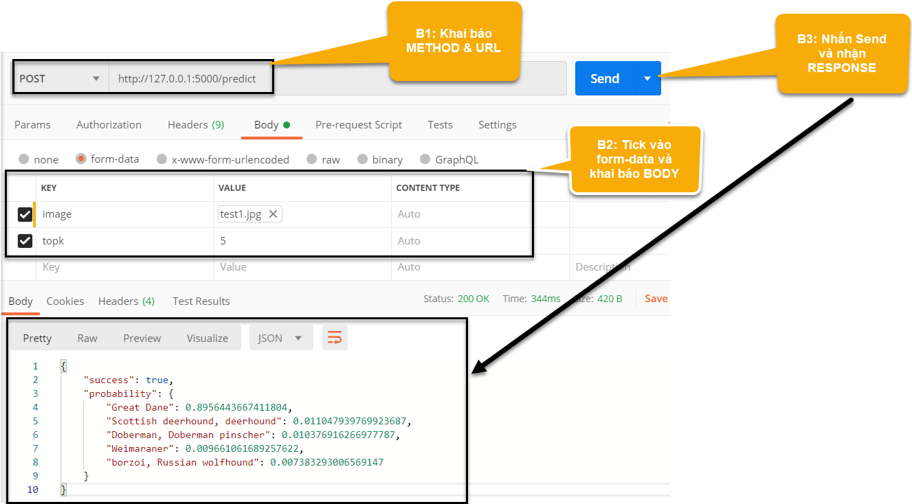

# Deploy-ML-Model-by-using-Flask
Sau khi xây dựng được model việc tiếp theo cần làm là deploy production. Để làm được điều này cần có kĩ năng về:
* Thiết kế API back end services cho các ứng dụng
* Front end
* DevOps để triển khai hạ tầng và môi trường

API được coi như chất liệu để làm nên một website. Khi chúng ta tương tác với một ứng dụng là tương tác với dữ liệu của ứng dụng đó được render trong một template html. Dữ liệu đó đến từ đâu? Nó được truyền đến thiết bị của bạn thông qua chính API. API là chiếc cầu nối dữ liệu qua lại giữa client và server và thay đổi những gì mà chúng ta nhìn thấy trên front end. Các phương thức tương tác dữ liệu trên API chính bao gồm: GET, POST, PUT, PATCH, DELETE. Đối với những beginner thì mình nghĩ chỉ cần hiểu GET, POST là đủ.


* GET: Client nhận dữ liệu từ server.
* POST: Client gửi dữ liệu lên server. Server xử lý dữ liệu và trả về một kết quả.

Để khởi tạo API trên Flask chúng ta phải khởi tạo các `app` truowcs. Sau đó tương ứng với mỗi API chúng ta sẽ khai báo 3 thành phần:
* `route`: địa chỉ `url` của API
* `method`: phương thức để tương tác với API. Nếu muốn gửi dữ liệu lên server thì là `POST`, muốn nhận dữ liệu từ server là `GET`
* Hàm xử lý dữ liệu: xử lý dữ liệu và trả lại cho client
Xem ví dụ bên dưới để hiểu thêm các tạo API.
```python
from flask import Flask, request

# Khởi tạo flask app
app = Flask(__name__)
# route và method
@app.route("/", methods=["GET"])    # nhận dữ liệu từ serve
# Hàm xử lý dữ liệu
def _hello_world():
    return "Hello World!"
```
Chỉ cần như thế là bạn đã khởi tạo được một app trên flask rồi đó. Tất nhiên đối với những dự án lớn thì sẽ cần nhiều thứ phức tạp hơn như bảo mật, design pattern API.

# Xử lý code theo design pattern
Design pattern - mẫu thiết kế có sẵn để code project sao cho đẹp mắt, gọn gàng, thuận tiện.
* Các hàm chức năng đặt trong file `utils.py`. Trong này chứa các hàm thông dụng hay sử dụng trong nhiều files khác nhau.
* Luôn lưu các parameters của project vào một file `hyper.py`. Việc đặt các hyperparameters ở chung 1 file rất có lợi vì các tham số có thể xuất hiện ở nhiều file khác nhau.
* Đặt các packages sử dụng vào file `requirements.txt` để khi chuyển giao code cho người khác có thể chạy lại đúng môi trường local, tránh tình trạng báo lỗi.
* Nên cài đặt `virtual environment` cho mỗi project để tránh xung đột version.

Ngoài ra còn file `imagenet.py` lưu các classes của bộ dữ liệu ImageNet.

# Chạy
```python
python serve.py
```
Khi thành công sẽ xuất hiện dòng `Running on http://127.0.0.1:5000/`. Chúng ta có thể kiểm tra chức năng API bằng lệnh `curl` nếu dụng hệ điều hành nhân UNIX.
```
curl -X POST -F image=@test1.jpg 'http://127.0.0.1:5000/predict'
```
Nếu sử dụng `window` thì có thể dùng `postman` 

Ở bước 2 nhớ import file ảnh vào mới nhận.

# Cài đặt postman


